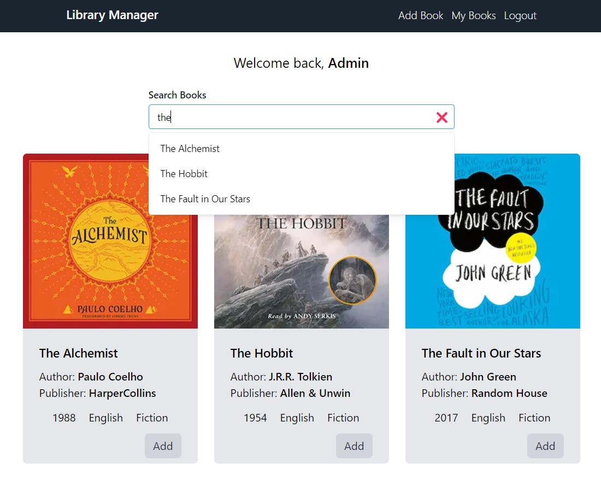

# Library Manager

A library manager web app using [Spring Boot](https://spring.io/projects/spring-boot) and [Next.js](https://nextjs.org/).

## Screenshots

## Technology Stack

- [Spring Boot](https://spring.io/projects/spring-boot) - Backend
- [Next.js](https://nextjs.org/) - Frontend
- [Tailwind CSS](https://tailwindcss.com/) - CSS Library

## Features

- User authentication
- User registration
- User password reset
- Library management
- Book borrowing

## APIs

| Endpoint | Type | Description |
| -------- | ---- | ----------- |
| `api/v1/user/login` | POST | Handle user login |
| `api/v1/user/register` | POST | Create a new user |
| `api/v1/user/update` | POST | Reset user password |
| `api/v1/user/borrow` | POST | Borrow a book |
| `api/v1/user/return` | POST | Return a book |
| `api/v1/user/borrowed` | GET | Get all borrowed books |
| `api/v1/library/books` | GET | Get all books |
| `api/v1/library/add` | POST | Add a new book |

## Team

    <a href="https://github.com/tasnimzotder">
        
        &nbsp&nbsp&nbsp&nbsp
    </a>
    <a href="https://github.com/Dama2820">
        
        &nbsp&nbsp&nbsp&nbsp
    </a>
    <a href="https://github.com/niv2002">
        
        &nbsp&nbsp&nbsp&nbsp
    </a>
    <a href="https://github.com/paritosh-11">
        
        &nbsp&nbsp&nbsp&nbsp
    </a>

## License

This project is licensed under the [MIT license](LICENSE.md).
